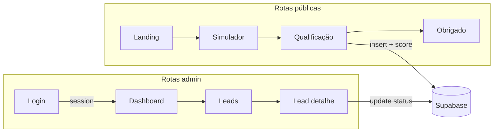

# Plano por fases — pré-venda qualificada de consórcios

Planeamento dividido em **ficheiros independentes** para avançar com precisão e contexto focado em cada etapa.

## Referência obrigatória

- **[`REFERENCIA-DADOS-CANONICOS.md`](REFERENCIA-DADOS-CANONICOS.md)** — tabela real crédito/parcela e regras HIGH / LOW / DESCARTADO. **Não desviar** destes valores ao implementar.

## Stack (resumo)

- React + Vite, React Router DOM (várias rotas, lazy load), TailwindCSS, HeroUI, React Hook Form, Zod, Zustand, Supabase (DB + Auth).

## Fluxo e arquitetura (visão geral)

## Ficheiros por fase

| Ordem | Ficheiro | Conteúdo |
|------:|----------|----------|
| 0 | [`fase-0-bootstrap.md`](fase-0-bootstrap.md) | Projeto Vite, dependências, Tailwind/HeroUI, pastas, router esqueleto |
| 1 | [`fase-1-tipos-utils-e-negocio.md`](fase-1-tipos-utils-e-negocio.md) | Types, tabela oficial, moeda, parcela, score/classificação |
| 2 | [`fase-2-supabase.md`](fase-2-supabase.md) | Schema `leads` + `interacoes`, RLS, serviços |
| 3 | [`fase-3-estado-hooks.md`](fase-3-estado-hooks.md) | Zustand, `useAuth`, `useLeads` |
| 4 | [`fase-4-ui-publica.md`](fase-4-ui-publica.md) | Landing, simulador, qualificação, obrigado |
| 5 | [`fase-5-admin.md`](fase-5-admin.md) | Login, rotas protegidas, dashboard, lista, detalhe |
| 6 | [`fase-6-polimento.md`](fase-6-polimento.md) | Loading, erros, tracking, a11y |

## Ordem de execução recomendada

1. Fase 0 → 1 (núcleo testável).
2. Fase 2 + primeiro `createLead` end-to-end.
3. Fase 4 (fluxo público), depois Fase 3 onde faltar estado partilhado.
4. Fase 5 admin.
5. Fase 6 transversal.

## Contexto do repositório

O workspace **pode iniciar vazio**; a Fase 0 cobre bootstrap ou alinhamento de projeto já criado.

## Estrutura de pastas alvo (`src/`)

`components/`, `pages/`, `hooks/`, `services/`, `store/`, `utils/`, `types/`
